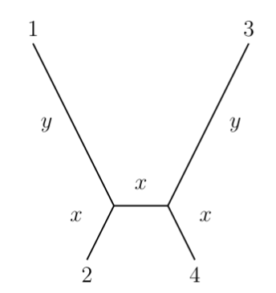
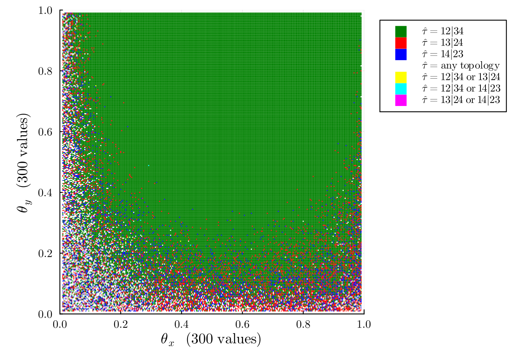

# Package summary
  
  This Julia package implements statistical inference using maximum likelihood estimation (MLE) to
  estimate a 4-leaf phylogenetic tree from DNA sequence data. The assumed model is the
  Cavendar-Farris-Neyman (CFN) model from phylogenetics.
  
  Unlike other methods, the implementation in this package does not rely on a heuristic search to solve
  the global optimization problem. Instead, the solution to the MLE problem is obtained through direct
  computation of the critical points of the likelihood function using both analytical methods as well as
  tools from numerical algebraic geometry.

# Quickstart instructions

First, open a Julia REPL from the command line by running
```
julia --threads=auto
```
The optional flag `--threads=auto` is recommended for best performance. (Once Julia is running, you can
check the number of threads with `Threads.nthreads()`.)

Second, to get the package and all dependencies, run
```
using Pkg; Pkg.add("FourLeafMLE")
```
This step may take a few minutes. 

Finally, load the package by running
```
using FourLeafMLE
```

You can now run all the functions in the export list of [FourLeafMLE.jl](/src/FourLeafMLE.jl). Note
that the first time you run a function in Julia, it will take some time to precompile.

As an example, suppose our data take the form of the site pattern frequency vector 
`[123,43,54,83,21,32,24,51]`. We can perform maximum likelihood estimation on this data by by
running

```
fourLeafMLE([123,43,54,83,21,32,24,51])
```

To obtain a list of all local maxima over both interior and boundary components of the model, run

```
listMaxima([123,43,54,83,21,32,24,51])
```

# Additional documentation

For more specific instructions (and examples) for using the estimation functions, see the function 
docstrings, for example by running

```
@doc fourLeafMLE
```

Additional detailed information about how to interpret the output of the estimation functions is also povided in 
[supplemental-documentation.pdf](https://github.com/max-hill/FourLeafMLE.jl/raw/main/supplemental-documentation.pdf)


# Background: tree topologies and the tree of life

One of the core motivations in evolutionary biology is to reconstruct
the *tree of life* that describes how species have evolved over time. A
common approach is to use DNA sequence alignment data from present-day
taxa to infer a *phylogenetic tree*, understood as a leaf-labelled tree
with edges representing ancestral populations, vertices representing
common ancestors, and leaves representing extant taxa. The edge weights,
or *branch lengths* represent some measure of evolutionary time (usually
expected number of mutations per site), and the tree *topology*
describes clade structure of the taxa. For instance,
[Figure 1](#fig1) has four leaves that are labeled
in such a way to indicate species $1$ and $2$ have a more recent common
ancestor with one another than with species $3$ or $4$.

A phylogenetic tree thus represents a hypothesis about the evolutionary
history of a set of taxa; the statistical inference problem is to infer
the tree topology and branch lengths from a DNA sequence of fixed
length. Our implementation solves polynomial systems to perform
this inference.

# Maximum likelihood estimation and quartet methods

A standard approach to inferring a phylogenetic tree is to use maximum
likelihood estimation. By summarizing data as a vector $(u_1,\dots,u_n)$
of counts, the goal is to maximize the likelihood of the data. In other
words, we seek the value of $\theta$ that maximizes
$p_1^{u_1}\cdots p_n^{u_n}$ where $p_i$ is the probability of observing
event $i$ and each $p_i$ depends on the parameters $\theta$ of the
model. The maximum likelihood problem addressed in `fourLeafMLE`
involves estimating the branch lengths and unrooted tree topology of a
4-leaf tree from sequence data of a fixed length $k$ generated according
to the Cavendar-Farris-Neyman (CFN) model [12].

Considerable research has focused on understanding the properties of
maximum likelihood estimation. Even in the simplest cases of 3- and
4-leaf trees, the problem exhibits substantial complexity, with a
general solution known for 3-leaf trees, but not 4-leaf trees
[1,4,6,7,8,9,11,16].
The $4$-leaf case considered here is of special interest first due to
the popularity of quartet-based inference methods for inferring both
phylogenetic trees and networks [15], and second because it
is the simplest case in which the phenomenon of *long-branch attraction*
can be observed, a form of estimation bias which is only partially
understood [2,14].

Two challenges in optimizing the likelihood function are its non-convex
nature and the presence of numerous boundary cases during optimization.
Moreover, there can be multiple distinct maximizers of the likelihood
function, and the maximizers can have branch lengths which are
infinitely long or zero [5,13]. This package resolves
these two obstacles for the CFN model by using computer algebra and the
theory of maximum likelihood (ML) degrees [10]. One feature
distinguishing this software is that it implements a framework to
characterize case when the tree estimates have infinite or zero-length
branches. We believe this is useful in obtaining an understanding of
ways that maximum likelihood inference can fail, and as a first step
leads to [Figure 1](#fig1).

# Running the maximum likelihood estimator

Our main contribution puts algebra into practice by implementing a
custom tailored solver for algebraic statisticians. Given data in the
form of a site frequency vector, the main functionality is to return a
list of global maximizers of the likelihood function. The output
includes information about each of the maximizers, for example the tree
configuration and optimal branch lengths.

```
    SITE_PATTERN_DATA = [212, 107, 98, 115, 114, 89, 102, 163]
    fourLeafMLE(SITE_PATTERN_DATA)
```

which has output

```
    1-element Vector{Vector{Any}}:
     [-2036.1212979788797, 
      "R1", 
      [1], 
      [0.1380874841, 0.46347429951, 0.5231552324, 0.3975875363, 0.6835395124], 
      "θ1, θ2, θ3, θ4, θ5", 
      "binary quartet with topology τ=1"]
```

For complete details on the code, see the code documentation provided here, but now we
give a broad overview about our software. The CFN model is a
parameterized semialgebraic set in $\mathbb{R}^8$ with dimension $6$. We
optimize the likelihood function by partitioning the semialgebraic set
according to boundaries from the parameterization, similiar to the
approach in [1] for a different model. There are $10$
different boundaries up to symmetry. All but one of them have ML degree
less than two. The last one has ML degree 92 while the main component of
the semialgebraic set has ML degree fourteen.[^1] We optimize the
likelihood function on each of the boundary cases by solving the
likelihood equations [10] by using analytic expressions when the
ML degree is less than two and
`Homotopy Continuation.jl` [@HomotopyContinuation.jl] to compute the
critical points otherwise.

# Putting into practice: Visualizing the geometry of data

Our method is fast. On a desktop machine with 12 i5-10400 CPUs
(2.90GHz), the `fourLeafMLE` solves on average 7.8 global optimization
problems per second. This is sufficiently fast to create high-quality
visualizations of the geometry of the maximum likelihood problem. 

For example, consider 4-leaf trees of the following form:



The following plot consists of a grid
of $90,000$ points, each representing a choice of Hadamard edge length
parameters $\theta_x,\theta_y$ (see [12]) for the
above tree:
<figure>
  
<figcaption> 
  Figure 1. MLE topologies for random data, represented by color. 
  For each point, maximum likelihood estimation was performed using 
  random data (1000b) drawn according to the CFN process on the tree 
  with edge parameters corresponding to the point. The point was then 
  colored according to which binary quartet topologies were found to 
  be compatible with the maximum likelihood estimates. The reddish 
  bottom right corner of the plot provides a new visualization of the
  long-branch attraction phenomenon.
</figcaption>
</figure>
<a id="fig1"></a>

# Tests
To run the tests in [test/runtests.jl](test/runtests.jl), open Julia with working directory `path/to/FourLeafMLE/` and run

```
using Pkg; Pkg.activate(".")
Pkg.test("FourLeafMLE")
```

Note this will return a (harmless) deprecation warning about the use of `LU`. Most of the tests involve
generating random 4-leaf trees and then performing maximum likelihood estimation on each tree using the
model as data. When a test is passed, that means the randomly-generated trees were all (or almost all)
correctly estimated. Some of these tests will fail on occasion due to approximation errors in the
arithmetic. Additional commentary and details about failure rates and causes can be found in
[test/runtests.jl](test/runtests.jl)

# Citations

1. Allman ES, Rhodes JA. Phylogenetic invariants for the general Markov model of sequence mutation. Mathematical Biosciences. 2003;186(2):113-144. doi:10.1016/j.mbs.2003.08.004

2. Bergsten J. A review of long-branch attraction. Cladistics. 2005;21(2):163-193.

3. Breiding P, Timme S. HomotopyContinuation.jl: A Package for Homotopy Continuation in Julia. In: International Congress on Mathematical Software. Springer; 2018:458-465.

4. Chor B, Hendy M, Penny D. Analytic solutions for three taxon ML trees with variable rates across sites. Discrete Applied Mathematics. 2007;155(6-7):750-758.

5. Chor B, Hendy MD, Holland BR, Penny D. Multiple Maxima of Likelihood in Phylogenetic Trees: An Analytic Approach. Molecular Biology and Evolution. 10 2000;17(10):1529-1541. doi:10.1093/oxfordjournals.molbev.a026252

6. Chor B, Snir S. Molecular clock fork phylogenies: Closed form analytic maximum likelihood solutions. Systematic Biology. 2004;53(6):963-967.

7. Garcia-Puente LD, Porter J. Small Phylogenetic Trees https://www.coloradocollege.edu/aapps/ldg/small-trees/small-trees_0.html. Published online 2007.

8. Hill M, Roch S, Rodriguez JI. Maximum Likelihood Estimation for Unrooted 3-Leaf Trees: An Analytic Solution for the CFN Model. bioRxiv. Published online 2024:2024-2002.

9. Hobolth A, Wiuf C. Maximum likelihood estimation and natural pairwise estimating equations are identical for three sequences and a symmetric 2-state substitution model. Theoretical Population Biology. Published online 2024.

10. Hoşten S, Khetan A, Sturmfels B. Solving the likelihood equations. Found Comput Math. 2005;5(4):389-407. doi:10.1007/s10208-004-0156-8

11. Kosta D, Kubjas K. Maximum likelihood estimation of symmetric group-based models via numerical algebraic geometry. Bull Math Biol. 2019;81(2):337-360. doi:10.1007/s11538-018-0523-2

12. Semple C, Steel M, Phylogenetics. Vol 24. Oxford University Press on Demand; 2003.

13. Steel M. The Maximum Likelihood Point for a Phylogenetic Tree is not Unique. Systematic Biology. 1994;43(4):560-564. Accessed August 21, 2023. http://www.jstor.org/stable/2413552

14. Susko E, Roger AJ. Long Branch Attraction Biases in Phylogenetics. Systematic Biology. 02 2021;70(4):838-843. doi:10.1093/sysbio/syab001

15. Warnow T. Computational Phylogenetics: An Introduction to Designing Methods for Phylogeny Estimation. Cambridge University Press; 2017. doi:10.1017/9781316882313

16. Yang Z. Complexity of the simplest phylogenetic estimation problem. Proceedings of the Royal Society of London Series B: Biological Sciences. 2000;267(1439):109-116.


[^1]: The numbers 14 and 92 were computed previously in [7].
